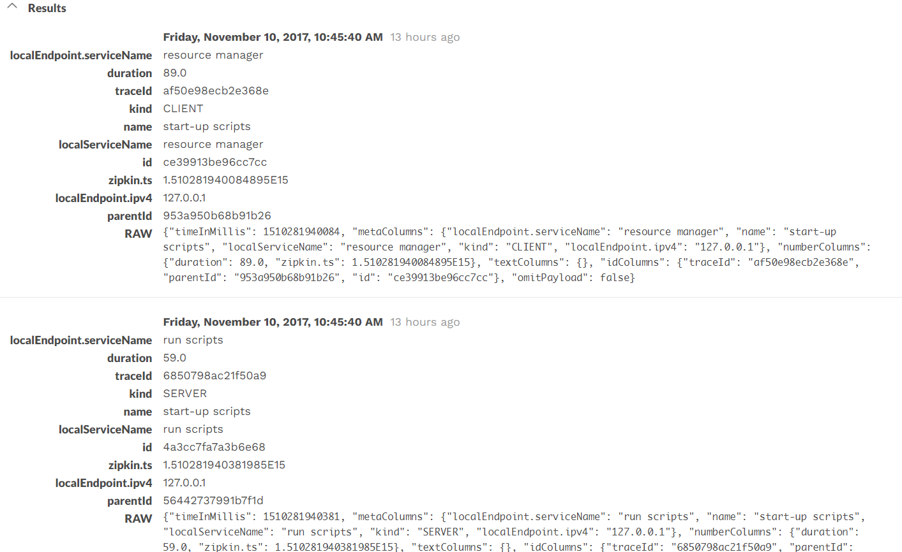

# Dashbase Zipkin Backend

This is is a plugin to the dashbase storage component, which uses dashbase engine as the backend of zipkin. 

## Quick Start

### Manual

#### Config

You can set these configs using environment vars.

> API_URL

Dashbase API URL.

- default: http://localhost:9876
- example1: http://localhost:9876
- example2: https://localhost:9876

> KAFKA_URL

Dashbase kafka hosts of table. Split by commas.

- default: localhost:9092
- example: 13.115.135.66:9092
- example2: 13.115.135.66:9092,13.115.135.66:9093

> KAFKA_TOPIC

Kafka topic of Dashbase table.

- default: nginx_json

> TABLE_NAME

Dashbase table name.

- default: nginx_json

#### Run Your dashbase and kafka

#### Run zipkin-server

```bash
./mvn -DskipTests --also-make -pl zipkin-server clean package
```

You should see something like this:

```
23:36:20.921 [main] INFO  o.s.b.c.e.t.TomcatEmbeddedServletContainer - Tomcat started on port(s): 9411 (http)
23:36:20.928 [main] INFO  zipkin.server.ZipkinServer - Started ZipkinServer in 10.543 seconds (JVM running for 12.449)
```

#### Run zipkin-spans-generator

In order to run the generator, you can refer to https://github.com/dashbase/zipkin-data-generator.

```bash
cd ${GENERATOR_BASE}
mvn clean && mvn package
java -jar target/mock-spans-1.0-SNAPSHOT-jar-with-dependencies.jar -n 30 -c zipkin-backend -t dashbase
```

#### Query in dashbase-ui

Wait a minutes to wait dashbase for ingesting, then you can see spans in dashbase Enjoy the dashbase-zipkin!



#### Query in zipkin-ui

> todo

### Docker-compose

> todo

